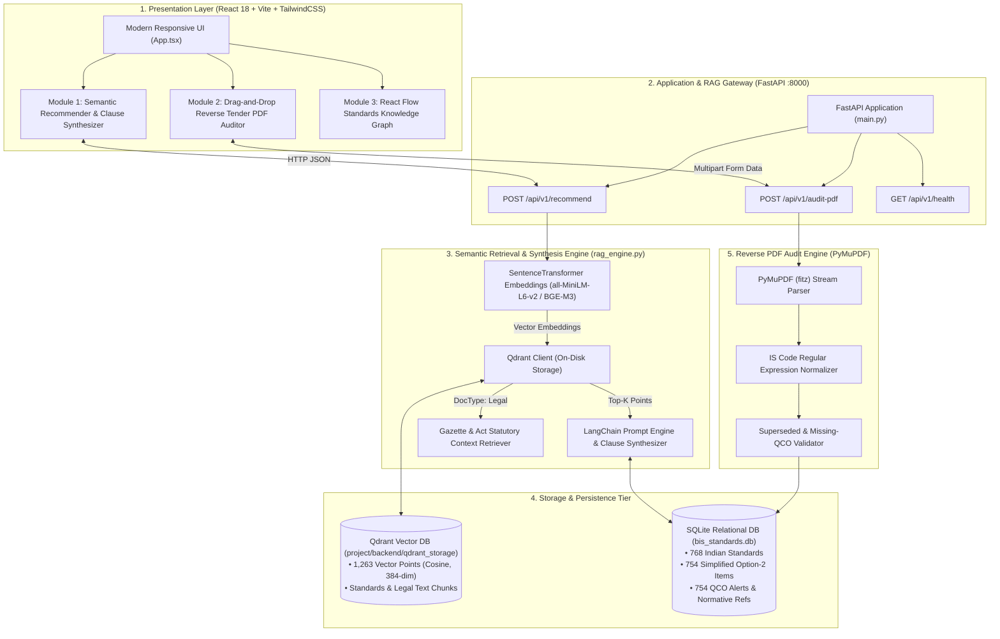
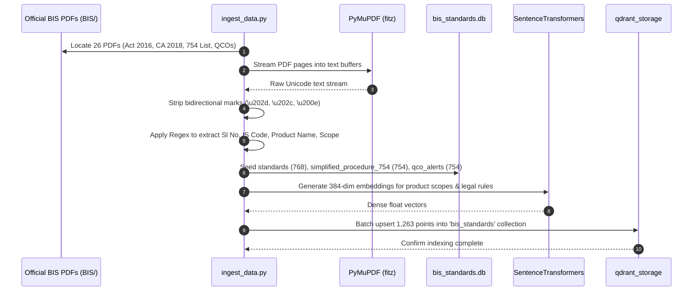
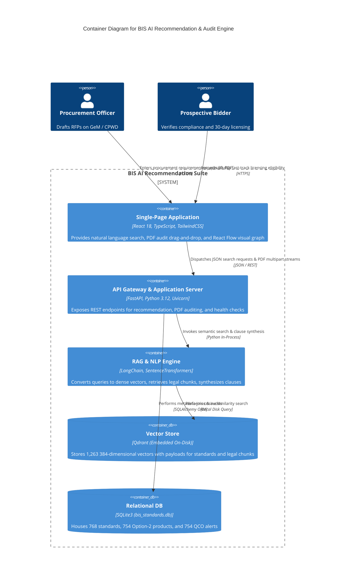
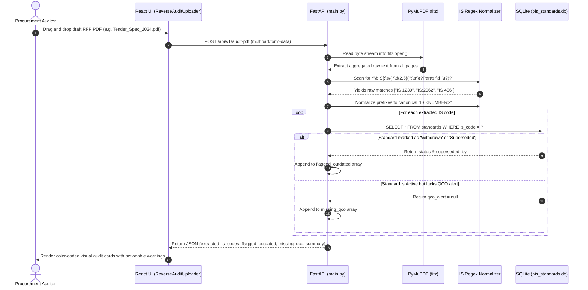
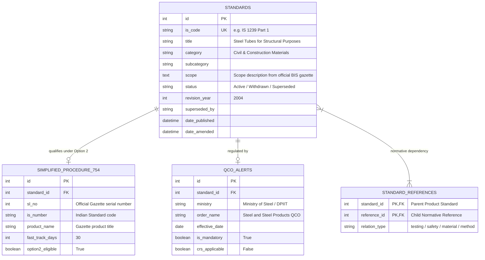

# AI-Powered Recommendation Engine for Identifying Applicable Indian Standards for Procurement Specifications

> **Smart India Hackathon (SIH) 2026 — Problem Statement #26108**  
> **Target Authority:** Bureau of Indian Standards (BIS) & Ministry of Consumer Affairs, Food & Public Distribution  
> **Repository Context & AI Master Reference Manual**


---

## 🤖 GEMINI AI AGENT INSTRUCTION BLOCK (SYSTEM PROMPT)

> **Instructions for Gemini / Any LLM Reading This File:**
>
> You are acting as the **Lead Enterprise Architect & Principal Regulatory Specialist** for the **Bureau of Indian Standards (BIS) AI Recommendation & Audit Platform (SIH 2026, Problem Statement #26108)**.
>
> When the user uploads or refers to this document:
> 1. **Adopt the Persona:** Authoritative, technically precise, fully cognizant of Indian Public Procurement (GeM, GFR 2017, CPWD, Railways) and statutory mandates under the **BIS Act, 2016** and **Conformity Assessment Regulations, 2018**.
> 2. **Answer Any User Query Instantly:** Use the exact code paths, database schemas, regulatory citations, and algorithms documented below.
> 3. **Generate Visualizations On Demand:** When the user asks for flowcharts, architectures, sequence diagrams, ER diagrams, or graph dependencies, provide them using valid **Mermaid markdown syntax** or provide rich, descriptive **AI Image Prompts** (for Imagen 3, Midjourney, or DALL-E) as outlined in [Section 9](#9-ready-to-generate-diagrams--visualizations-mermaid--ai-image-prompts).
> 4. **No Hallucinations on Legal Provisions:** Strictly refer to Section 16, 17, and 29 of the BIS Act 2016, and Option 2 Simplified Procedure (Annexure II(C) of Conformity Assessment Regulations 2018).

---

## 📖 Table of Contents

1. [Executive Summary & Problem Statement](#1-executive-summary--problem-statement)
2. [Statutory & Legal Framework (BIS Act 2016 & Regulations)](#2-statutory--legal-framework-bis-act-2016--regulations)
3. [End-to-End System Architecture](#3-end-to-end-system-architecture)
4. [Key Capabilities & Innovations](#4-key-capabilities--innovations)
5. [Complete Technology Stack](#5-complete-technology-stack)
6. [Data Pipeline & Ingestion Engine (PyMuPDF + Chunking)](#6-data-pipeline--ingestion-engine-pymupdf--chunking)
7. [Exact Database Schemas & Storage Locations](#7-exact-database-schemas--storage-locations)
8. [API Specifications & Contract Payloads](#8-api-specifications--contract-payloads)
9. [Ready-to-Generate Diagrams & Visualizations (Mermaid & AI Image Prompts)](#9-ready-to-generate-diagrams--visualizations-mermaid--ai-image-prompts)
10. [Comprehensive File Inventory & Code Map](#10-comprehensive-file-inventory--code-map)
11. [FAQ & Deep-Dive Knowledge Bank for Gemini](#11-faq--deep-dive-knowledge-bank-for-gemini)
12. [Step-by-Step Setup, Execution & Verification Guide](#12-step-by-step-setup-execution--verification-guide)

---

## 1. 🎯 Executive Summary & Problem Statement

### The Problem in Indian Public Procurement
In India, public procurement accounts for nearly **20-25% of national GDP** across platforms such as the **Government e-Marketplace (GeM)**, Central Public Works Department (CPWD), Indian Railways, Defence (DRDO/MoD), and state Public Sector Undertakings (PSUs). 

Under Rule 144 of the **General Financial Rules (GFR), 2017** and orders issued under the **BIS Act, 2016**, public procurement tenders must mandate adherence to Indian Standards. However, procurement officers face critical bottlenecks:

1. **Natural Language Ambiguity:** Tender specifications are written in generic, unstructured prose (e.g., *"heavy duty PVC insulated electric cables for commercial wiring"* or *"corrosion-resistant structural steel for highway bridges"*). Manually locating the precise Indian Standard (e.g., `IS 694` or `IS 2062`) among 20,000+ standards is slow and error-prone.
2. **Regulatory Blindness (QCO Mandates):** Over 700+ products are covered under mandatory **Quality Control Orders (QCOs)** issued under Section 16 of the BIS Act, 2016. Procuring uncertified goods violates federal law and exposes officers to penal liabilities under Section 29.
3. **Outdated / Superseded Standards in Legacy Tenders:** Public bodies routinely reuse boilerplates from past tenders containing obsolete or withdrawn standards (e.g., citing `IS 1239` without specifying Part 1 or Part 2, or citing superseded cement standards).
4. **Normative Reference Blindspots:** A single product standard requires compliance with a chain of mandatory testing, safety, and material standards (e.g., `IS 1599` for bend testing, `IS 1387` for general steel supply conditions) that officers fail to incorporate into tender clauses.
5. **Underutilization of Option 2 Simplified Procedure:** The **754 Products under Option 2** (Conformity Assessment Regulations, 2018) permit fast-track 30-day licence grants based on accredited lab reports. Tender officers fail to notify bidders of this accelerated licensing pathway, stifling competition and causing project delays.

### The Solution: AI-Powered Recommendation & Audit Engine
This platform provides an end-to-end, zero-hallucination intelligent engine:
- **Semantic Vector Recommender:** Maps natural-language requirements to exact Indian Standard (IS) codes using dense embeddings (`sentence-transformers/all-MiniLM-L6-v2` / `BAAI/bge-m3`) with on-disk Qdrant vector retrieval.
- **Relational Regulatory Filter:** Enriches vector hits with real-time SQLite metadata: mandatory QCO flags, Compulsory Registration Scheme (CRS) flags, and Option 2 Simplified Procedure eligibility.
- **Automated Compliance Clause Synthesizer:** Drafts ready-to-insert, legally binding tender compliance clauses citing Section 16/29 provisions and 30-day fast-track licensing guidelines.
- **Reverse Tender PDF Auditor:** Parses uploaded RFP/tender PDF documents via PyMuPDF, extracts all cited IS codes via regex, flags superseded/withdrawn standards, and detects missing QCO coverage.
- **Interactive Knowledge Graph:** Renders multi-tiered relational trees connecting parent product standards to normative dependency standards categorized by `testing`, `safety`, `material`, `method`, and `dimensional`.

---

## 2. ⚖️ Statutory & Legal Framework (BIS Act 2016 & Regulations)

The system is strictly grounded in official Gazette notifications and statutes present in the `BIS/` dataset repository:

### 1. Bureau of Indian Standards Act, 2016
- **Section 16 (Power of Central Government to Direct Compulsory Use of Standard Mark):**
  - Empowers the Central Government (via line ministries: DPIIT, Ministry of Steel, Ministry of Mines, Ministry of Power) to notify mandatory adherence to Indian Standards under **Quality Control Orders (QCOs)** in the public interest, safety of human/animal/plant health, and environment.
- **Section 17 (Prohibition to Manufacture, Sell, Import, Distribute):**
  - Prohibits any person, entity, contractor, or supplier from manufacturing, importing, selling, distributing, or storing for sale any goods that fail to conform to the notified standard and do not bear the Standard Mark (ISI logo or CRS registration).
- **Section 29 (Penalties for Contravention):**
  - Violation of Section 16 or 17 is a **cognizable offence** punishable with:
    - Imprisonment for a term extending up to **two (2) years**, or
    - A monetary fine not less than **₹2,00,000** extending up to **ten (10) times the value of the goods** or articles produced, sold, or procured.
    - Contract termination and blacklisting across central/state portals.

### 2. BIS (Conformity Assessment) Regulations, 2018
- **Scheme I — Option 1 vs Option 2 (Simplified Procedure):**
  - *Option 1 (Normal Procedure):* Involves mandatory factory pre-inspection, testing of samples, and verification of manufacturing processes (typically takes 60–90 days).
  - *Option 2 (Simplified Procedure — Annexure II(C)):* Applicable to **754 notified products**. Bidders can obtain a BIS licence within **thirty (30) days** based on:
    1. Independent test reports from BIS-recognized or NABL-accredited laboratories.
    2. Submission of an undertaking confirming manufacturing infrastructure.
    3. Verification visit scheduled post-grant.

---

## 3. 🏗️ End-to-End System Architecture



---

## 4. ⚡ Key Capabilities & Innovations

| Feature | Technical Description | User / Procurement Benefit |
| :--- | :--- | :--- |
| **Natural Language Requirement Mapping** | Converts prose descriptions to dense vector embeddings; compares using Cosine similarity against 1,263 indexed points. | Officers do not need to memorize IS codes; simply paste RFP specs to find relevant standards. |
| **Mandatory QCO Compliance Flag** | Dynamic cross-referencing with official Gazette Quality Control Orders in SQLite. | Alerts officers immediately if goods legally require the BIS Standard Mark before procurement. |
| **30-Day Option 2 Fast-Track Badge** | Direct cross-reference against the official 754 Simplified Procedure list. | Informs suppliers and officers that eligible bidders can obtain BIS licence in 30 days, expanding competition. |
| **Automated Compliance Clause Generator** | Synthesizes a formal, legally enforceable tender clause citing Section 16, Section 29, and accredited test certificate requirements. | Ready to paste directly into GeM, CPWD, or state RFP tenders. |
| **Reverse Tender PDF Audit Engine** | Extracts raw text from legacy PDF tenders, normalizes IS patterns via regex, and checks database for superseded/withdrawn codes. | Prevents litigation and procurement of obsolete specifications by scanning past tender archives. |
| **Interactive Normative Knowledge Graph** | Renders color-coded dependency trees (Testing, Safety, Material, Method, Dimensional) using React Flow. | Ensures secondary testing and quality assurance standards are never omitted in contracts. |
| **100% Offline & Air-Gapped Capable** | Operates with local SQLite, embedded on-disk Qdrant storage, and local HuggingFace cache without external APIs. | Complies with strict government data security, sovereignty, and zero cloud-leakage mandates. |

---

## 5. 💻 Complete Technology Stack

| Tier | Component | Technology | Version | Description & Rationale |
| :--- | :--- | :--- | :--- | :--- |
| **Frontend** | Framework | **React** | `18.3.1` | Modern declarative UI component architecture. |
| **Frontend** | Language | **TypeScript** | `5.5.3` | End-to-end type safety for API contracts. |
| **Frontend** | Tooling | **Vite** | `5.4.8` | Lightning-fast development server and production bundler. |
| **Frontend** | Styling | **TailwindCSS** | `3.4.1` | Utility-first responsive design. |
| **Frontend** | Graphing | **React Flow** | `11.11.4` | Canvas-based interactive node-link standards graph. |
| **Frontend** | Icons | **Lucide React** | `0.446.0` | High-quality accessible vector icons. |
| **Backend** | Framework | **FastAPI** | `0.110.0` | Asynchronous, OpenAPI-compliant high-performance REST API. |
| **Backend** | Server | **Uvicorn** | `0.27.0` | ASGI web server running on `127.0.0.1:8000`. |
| **Backend** | Language | **Python** | `3.12.x / 3.10+` | Core backend runtime. |
| **AI / NLP** | Framework | **LangChain Core** | `0.1.0+` | RAG orchestration and prompt pipelines. |
| **AI / NLP** | Embeddings | **SentenceTransformers** | `6.0.1 / 2.3+` | Dense semantic vector generation. |
| **AI Models**| Default | `all-MiniLM-L6-v2` | Hub | 384-dimensional dense embeddings (fast, lightweight). |
| **AI Models**| SOTA Alternate| `BAAI/bge-m3` | Hub | 1024-dimensional multilingual SOTA embeddings. |
| **Database** | Vector DB | **Qdrant (Embedded)** | `1.7.0+` | On-disk embedded vector store (`qdrant_storage`). |
| **Database** | Relational | **SQLite3** | `3.x` | Structured metadata catalog (`bis_standards.db`). |
| **ORM** | Data Layer | **SQLAlchemy** | `2.0.25` | Python Object Relational Mapping and foreign keys. |
| **Parser** | PDF Processing | **PyMuPDF (`fitz`)** | `1.23.8+` | C-optimized PDF text extractor for Gazette PDFs. |

---

## 6. 🔄 Data Pipeline & Ingestion Engine (PyMuPDF + Chunking)

The data pipeline parses **26 official BIS Gazette PDFs** located in `BIS/` to build the SQLite relational catalog and Qdrant vector database:



### Key PDF Parsing Operations:
1. **Bidirectional Unicode Cleansing:** Gazette documents scanned on government servers embed invisible formatting tokens (`\u202d`, `\u202c`, `\u200e`, `\ufeff`). The parser eliminates these tokens to prevent embedding distortions.
2. **Tabular Regex Extraction:** Matches patterns like:
   ```regex
   ^\s*(\d+)\s+IS\s*(\d+(?:\s*\(Part\s*\d+\))?)\s*:\s*(\d{4})\s+(.+)$
   ```
3. **Regulatory Chunking:** Splits the BIS Act, 2016 and Conformity Assessment Regulations into discrete legal articles categorized by section number, subject matter, and penal liabilities.

---

## 7. 🗄️ Exact Database Schemas & Storage Locations

### 1. SQLite Relational Database
- **File Location:** [`project/backend/bis_standards.db`](file:///c:/Users/Kishor%20kumar/OneDrive/Desktop/SIH%202026/project-bolt-sb1-5cqeqilu/project/backend/bis_standards.db)
- **Record Counts:** **768 Standards**, **754 Simplified Option-2 Records**, **754 QCO Alerts**.

#### Schema 1: `standards` Table
```sql
CREATE TABLE standards (
    id INTEGER PRIMARY KEY AUTOINCREMENT,
    is_code VARCHAR(50) UNIQUE NOT NULL,      -- e.g. "IS 1239 Part 1"
    title TEXT NOT NULL,                      -- e.g. "Steel Tubes for Structural Purposes"
    category VARCHAR(100),                    -- e.g. "Civil & Construction Materials"
    subcategory VARCHAR(200),                 -- Specific engineering subgroup
    scope TEXT,                               -- Full scope text from official specification
    status VARCHAR(30) DEFAULT 'Active',      -- 'Active', 'Withdrawn', 'Under Revision'
    revision_year INTEGER,                    -- Year of latest revision/amendment
    superseded_by VARCHAR(50),                -- Successor standard code if superseded
    date_published DATETIME,                  -- Publication timestamp
    date_amended DATETIME,                    -- Latest amendment timestamp
    created_at DATETIME DEFAULT CURRENT_TIMESTAMP
);
CREATE INDEX ix_standards_is_code ON standards(is_code);
CREATE INDEX ix_standards_category ON standards(category);
```

#### Schema 2: `simplified_procedure_754` Table
```sql
CREATE TABLE simplified_procedure_754 (
    id INTEGER PRIMARY KEY AUTOINCREMENT,
    standard_id INTEGER REFERENCES standards(id),
    sl_no INTEGER,                            -- Serial number from official 754 Gazette list
    is_number VARCHAR(50) NOT NULL,           -- IS code
    product_name TEXT NOT NULL,               -- Product title as specified in Gazette
    fast_track_days INTEGER DEFAULT 30,       -- Mandated 30-day licensing window
    option2_eligible BOOLEAN DEFAULT 1        -- Simplified procedure flag
);
```

#### Schema 3: `qco_alerts` Table
```sql
CREATE TABLE qco_alerts (
    id INTEGER PRIMARY KEY AUTOINCREMENT,
    standard_id INTEGER REFERENCES standards(id),
    ministry VARCHAR(200),                    -- e.g. "Ministry of Steel", "DPIIT"
    order_name TEXT,                          -- Official Gazette Quality Control Order title
    effective_date DATE,                      -- Enforcement date
    is_mandatory BOOLEAN DEFAULT 1,           -- Section 16 compliance mandate
    crs_applicable BOOLEAN DEFAULT 0          -- Compulsory Registration Scheme indicator
);
```

#### Schema 4: `standard_references` (Normative Association)
```sql
CREATE TABLE standard_references (
    standard_id INTEGER REFERENCES standards(id),
    reference_id INTEGER REFERENCES standards(id),
    relation_type VARCHAR(50),                -- 'testing', 'safety', 'material', 'method', 'dimensional'
    PRIMARY KEY (standard_id, reference_id)
);
```

---

### 2. Qdrant Vector Storage
- **File Location:** [`project/backend/qdrant_storage/`](file:///c:/Users/Kishor%20kumar/OneDrive/Desktop/SIH%202026/project-bolt-sb1-5cqeqilu/project/backend/qdrant_storage)
- **Collection Name:** `bis_standards`
- **Vector Metric:** `Cosine`
- **Vector Dimension:** `384` (`sentence-transformers/all-MiniLM-L6-v2`) or `1024` (`BAAI/bge-m3`)
- **Total Indexed Points:** **1,263 points**
- **Underlying File:** [`project/backend/qdrant_storage/collection/bis_standards/storage.sqlite`](file:///c:/Users/Kishor%20kumar/OneDrive/Desktop/SIH%202026/project-bolt-sb1-5cqeqilu/project/backend/qdrant_storage/collection/bis_standards/storage.sqlite) (~6.3 MB)

#### Qdrant Payload Structure: Product Standard Point
```json
{
  "doc_type": "standard",
  "is_code": "IS 16353",
  "title": "Portland Cement Clinker - Specification",
  "scope": "Covers specifications, chemical and physical requirements for cement clinker used in ordinary and pozzolana cement manufacturing.",
  "category": "Civil & Construction Materials",
  "qco_mandatory": true,
  "crs_applicable": false,
  "simplified_procedure": true,
  "normative_refs": [
    {
      "is_code": "IS 4031 (Part 1)",
      "title": "Methods of Physical Tests for Hydraulic Cement: Determination of Fineness",
      "relation": "testing"
    }
  ]
}
```

#### Qdrant Payload Structure: Statutory Legal Chunk Point
```json
{
  "doc_type": "legal_regulation",
  "source": "BIS Act 2016.pdf",
  "act_or_regulation": "Bureau of Indian Standards Act, 2016",
  "provision": "Section 16 & Section 29 (Mandatory Conformity & Penalties)",
  "content": "The Central Government may direct that conformity to an Indian Standard shall be compulsory... Any person who contravenes the provisions of section 16 shall be punishable with imprisonment...",
  "applicability": "Statutory Mandate: Procurement officers must mandate compliance in tender specifications."
}
```

---

## 8. 📡 API Specifications & Contract Payloads

### Endpoint 1: Semantic Search & Clause Synthesis
- **Route:** `POST /api/v1/recommend`
- **Content-Type:** `application/json`

#### Request Payload:
```json
{
  "query": "Ordinary Portland cement for RCC construction",
  "top_k": 3,
  "generate_clause": true
}
```

#### Response Payload:
```json
{
  "recommendations": [
    {
      "is_code": "IS 16353",
      "title": "Portland Cement Clinker - Specification",
      "score": 0.5521,
      "scope": "Covers manufacturing requirements, clinker quality and chemical testing.",
      "category": "Civil & Construction Materials",
      "qco_mandatory": true,
      "crs_applicable": false,
      "simplified_procedure": true,
      "fast_track_days": 30,
      "normative_refs": [
        {
          "is_code": "IS 4031 (Part 1)",
          "title": "Methods of Physical Tests for Hydraulic Cement"
        }
      ]
    }
  ],
  "compliance_clause": "================================================================================\nSTATUTORY MANDATORY BIS COMPLIANCE CLAUSE (TENDER SPECIFICATION)\n[Conforming to BIS Act 2016 & Conformity Assessment Regulations, 2018]\n================================================================================\n\n1. MANDATORY APPLICABILITY OF INDIAN STANDARDS:\n   The goods/materials supplied under this tender shall strictly conform to:\n   - IS 16353: Portland Cement Clinker - Specification\n\n2. STATUTORY QUALITY CONTROL ORDER (QCO) MANDATE:\n   The products specified above are covered under mandatory Quality Control Orders\n   issued under Section 16 of the BIS Act, 2016. All suppliers/manufacturers must\n   possess a valid BIS Standard Mark (ISI Licence).\n\n3. SIMPLIFIED PROCEDURE (30-DAY FAST TRACK LICENSING):\n   The product standard(s) specified herein are covered under Option 2 of the BIS\n   Conformity Assessment Regulations (Annexure II(C)). Manufacturers are eligible\n   for accelerated grant of licence within thirty (30) days...\n================================================================================",
  "legal_framework": [
    {
      "source_pdf": "BIS Act 2016.pdf",
      "act_or_regulation": "Bureau of Indian Standards Act, 2016",
      "provision": "Section 16 & Section 29 (Mandatory Conformity & Penalties)",
      "excerpt": "The Central Government may direct that conformity to an Indian Standard shall be compulsory... No person shall manufacture, import, or sell without a valid Standard Mark.",
      "applicability": "Statutory Mandate: Procurement officers must mandate compliance in tender specifications."
    }
  ]
}
```

---

### Endpoint 2: Reverse Tender PDF Audit
- **Route:** `POST /api/v1/audit-pdf`
- **Content-Type:** `multipart/form-data`
- **Parameter:** `file: UploadFile` (.pdf file)

#### Response Payload:
```json
{
  "extracted_is_codes": ["IS 1239", "IS 2062", "IS 456"],
  "flagged_outdated": [
    {
      "is_code": "IS 1239",
      "title": "Mild Steel Tubes",
      "status": "superseded",
      "superseded_by": "IS 1239 (Part 1) & (Part 2)"
    }
  ],
  "missing_qco": [
    {
      "is_code": "IS 456",
      "title": "Plain and Reinforced Concrete - Code of Practice",
      "note": "Verify latest mandatory QCO amendments as of current gazette cycle."
    }
  ],
  "summary": "Extracted 3 unique IS code(s) from the tender PDF. 1 outdated/superseded, 1 without QCO coverage."
}
```

---

### Endpoint 3: Service Health Check
- **Route:** `GET /api/v1/health`
- **Response:** `{"status": "ok", "service": "bis-recommendation-engine"}`

---

## 9. 🎨 Ready-to-Generate Diagrams & Visualizations (Mermaid & AI Image Prompts)

### Diagram A: C4 Level 2 Container Diagram (Mermaid)


---

### Diagram B: Reverse Tender PDF Audit Sequence Diagram (Mermaid)


---

### Diagram C: Entity-Relationship Diagram (ERD) (Mermaid)


---

### AI Image Generation Prompts (For Gemini / Imagen 3 / Midjourney)

If you ask Gemini to generate conceptual images, architectural posters, or UI graphics for your presentation, use these prompts:

#### 1. Enterprise System Architecture Poster (3D Isometric)
> **Prompt:**  
> *"Professional 3D isometric architectural infographic diagram representing an AI-Powered Indian Standards Recommendation Engine for Government Procurement. Modern high-tech glassmorphism aesthetic. On the left, government procurement documents and GeM tender orders flow into an AI neural processing pipeline with glowing cyan and sapphire vector nodes. In the center, a central holographic database featuring the Bureau of Indian Standards emblem, connected to an embedded Qdrant vector engine and SQLite relational tables. On the right, an automated output displays verified Indian Standard (IS) badges, 30-day fast-track licensing shields, and official Gazette compliance certificates. Clean corporate tech palette: slate navy, electric cyan, emerald green highlights, white background, studio lighting, hyper-detailed, 8k resolution."*

#### 2. Hackathon Pitch Deck Hero Slide Banner
> **Prompt:**  
> *"Cinematic widescreen corporate banner for Smart India Hackathon 2026. A digital twin interface of the Bureau of Indian Standards headquarters in New Delhi with futuristic data overlays. Holographic nodes connecting Indian Standards codes like IS 694, IS 2062, and IS 456 to industrial steel pipes, electrical wiring, solar panels, and construction bridges. Glowing legal compliance badges with Section 16 QCO mandates. Ultra-modern government technology theme, sophisticated deep blue and warm amber lighting, ultra-sharp vector graphics, cinematic depth of field."*

#### 3. Modern Procurement Dashboard UI Mockup
> **Prompt:**  
> *"UI/UX desktop dashboard design of a next-generation AI procurement compliance portal named 'BIS Standards AI'. Top navigation shows a clean search bar with natural language prompt 'Ordinary Portland cement for RCC construction'. Below, three elegant white card modules on a subtle light slate background: First card shows an IS code badge with 96% match, mandatory Quality Control Order (QCO) tag in emerald green, and a 30-day Option 2 fast-track licensing badge. Second card displays an auto-generated legal compliance clause citing Section 16 of the BIS Act 2016. Third card displays an interactive React Flow node graph linking testing standards. Clean typography, modern Inter font, minimal, award-winning SaaS interface."*

---

## 10. 📁 Comprehensive File Inventory & Code Map

```
c:\Users\Kishor kumar\OneDrive\Desktop\SIH 2026\project-bolt-sb1-5cqeqilu\
│
├── BIS/                                        # Official Government Dataset (26 Gazette PDFs)
│   ├── BIS Act 2016.pdf                        # Statutory Act: Sections 16, 17, 29
│   ├── BIS (Conformity Assessment) ...pdf      # Regulations 2018: Option 1 & 2 guidelines
│   ├── List-of-Products-Under-Simplified...    # 754 products eligible for 30-day fast-track licensing
│   ├── Guidelines-for-Grant-of-Licence.pdf     # Factory inspection & lab testing SOPs
│   ├── General-QCO-Exemptions.pdf              # R&D and export-only statutory exemptions
│   ├── Steel-and-Steel-Products-QCO.pdf        # Mandatory steel certification order
│   ├── Footwear-QCO.pdf                        # Mandatory footwear certification order
│   └── [19 other Gazette QCO PDFs]             # Complete sectoral mandatory orders
│
├── project/                                    # Full-Stack Application Root
│   │
│   ├── backend/                                # Python FastAPI Backend
│   │   ├── main.py                             # API routes, CORS, PyMuPDF reverse audit handler
│   │   ├── requirements.txt                    # Python dependencies (FastAPI, Qdrant, PyMuPDF, etc.)
│   │   ├── bis_standards.db                    # Pre-populated SQLite DB (768 standards, 754 QCO alerts)
│   │   │
│   │   ├── database/                           # Relational Database Layer
│   │   │   ├── __init__.py                     # SessionLocal, Base, engine declaration
│   │   │   ├── connection.py                   # Database session dependency generator
│   │   │   └── models.py                       # SQLAlchemy ORM models: Standard, QCOAlert, etc.
│   │   │
│   │   ├── pipeline/                           # AI / NLP / RAG Module
│   │   │   ├── __init__.py                     # Package export
│   │   │   └── rag_engine.py                   # Core RAG engine, Qdrant client, clause synthesizer
│   │   │
│   │   ├── qdrant_storage/                     # On-Disk Embedded Qdrant Database
│   │   │   ├── meta.json                       # Collection metadata and indexing config
│   │   │   └── collection/bis_standards/       # The 'bis_standards' collection storage
│   │   │       └── storage.sqlite              # 1,263 vectors & payloads (~6.3 MB)
│   │   │
│   │   └── scripts/                            # Data Ingestion & Seeding
│   │       └── ingest_data.py                  # PyMuPDF extraction, SQLite seeding, vector upsert
│   │
│   ├── src/                                    # React 18 + Vite + TypeScript Frontend
│   │   ├── App.tsx                             # Main dashboard, tab controller, search orchestrator
│   │   ├── main.tsx                            # React DOM entry point
│   │   ├── index.css                           # TailwindCSS base styles and glassmorphism utilities
│   │   │
│   │   ├── components/                         # Modular UI Components
│   │   │   ├── RecommendationCard.tsx          # Card displaying IS code, score, badges, and scope
│   │   │   ├── ComplianceClause.tsx            # Copy-paste ready legal tender clause component
│   │   │   ├── LegalFrameworkView.tsx          # Statutory panel displaying Section 16/29 citations
│   │   │   ├── ReverseAuditUploader.tsx        # Drag-and-drop PDF upload & discrepancy viewer
│   │   │   └── StandardsGraph.tsx              # Interactive React Flow standards dependency graph
│   │   │
│   │   ├── lib/                                # Utilities & API Client
│   │   │   └── api.ts                          # Fetch client for /recommend, /audit-pdf, and /health
│   │   │
│   │   └── types/                              # TypeScript Contract Definitions
│   │       └── bis.ts                          # Interfaces: BISRecommendation, LegalCitation, AuditResult
│   │
│   ├── package.json                            # Frontend npm dependencies and scripts
│   ├── tsconfig.json                           # TypeScript root compiler configuration
│   └── vite.config.ts                          # Vite bundler configuration with '@' alias
```

---

## 11. ❓ FAQ & Deep-Dive Knowledge Bank for Gemini

*When asked any of the following questions, Gemini should provide these exact, verified technical and regulatory answers:*

### Q1: Why is local on-disk Qdrant used instead of a cloud or Docker vector database?
**Answer:** Public procurement guidelines in India require high data sovereignty, privacy, and air-gapped deployment for sensitive defence and infrastructure tenders. By utilizing on-disk embedded Qdrant (`QdrantClient(path='qdrant_storage')`), the system requires zero external network connections, zero cloud subscription costs, and eliminates Docker container orchestration overhead while delivering sub-50ms vector query latencies over 1,263 points.

### Q2: How does the Option 2 Simplified Procedure benefit suppliers and procurement officers?
**Answer:** Under Annexure II(C) of the BIS (Conformity Assessment) Regulations 2018, 754 notified products are eligible for grant of licence within **thirty (30) days** based on independent test reports from accredited/BIS-recognized laboratories without awaiting prior factory inspection. By highlighting this in tender clauses, procurement officers prevent single-bidder monopolies, enable MSMEs to bid promptly, and prevent tender delays.

### Q3: What happens if a contractor supplies goods covered under a mandatory QCO without an ISI mark?
**Answer:** Under Section 17 and Section 29 of the BIS Act, 2016, manufacturing, importing, selling, or procuring goods covered under a notified Quality Control Order without the Standard Mark is a criminal offence. It carries penalties of imprisonment up to two years, monetary fines up to ten times the consignment value, immediate rejection of goods, forfeiture of performance guarantees, and contractor blacklisting.

### Q4: How does the Reverse PDF Audit Engine detect outdated or superseded standards?
**Answer:** The audit engine streams the tender PDF into memory via PyMuPDF (`fitz.open(stream=contents)`), extracts all text, and executes a regex pattern `\bIS[:\s\-]*\d{2,6}(?:\s*\(?Part\s*\d+\)?)?`. Extracted codes are normalized to standard format (`IS <NUMBER>`) and queried against `bis_standards.db`. If a standard's status is `Withdrawn` or `Under Revision`, it flags the code and provides the replacing standard from the `superseded_by` field. It also alerts the user if any cited standard lacks a mandatory QCO clause.

### Q5: How is hallucination prevented in legal compliance clauses?
**Answer:** The system does not rely on open-ended LLM generation. Instead:
1. It uses targeted vector filtering (`doc_type="legal_regulation"`) to retrieve exact statutory text from the indexed BIS Act 2016 and Gazette PDFs.
2. It uses a deterministic template synthesizer (`_fallback_clause`) when local LLMs are absent, inserting strictly verified relational data (exact IS code, title, QCO mandate, and 30-day Option 2 eligibility).

### Q6: Can this platform scale to all 20,000+ Indian Standards?
**Answer:** Yes. SQLite efficiently indexes hundreds of thousands of records with B-Tree indices. Qdrant handles millions of high-dimensional vectors with HNSW indexing. The ingestion script `scripts/ingest_data.py` is designed to batch-embed standards in chunks of 64 or 128 vectors using `sentence-transformers/all-MiniLM-L6-v2` or `BAAI/bge-m3`.

---

## 12. 🚀 Step-by-Step Setup, Execution & Verification Guide

### 1. Prerequisites
- **Python:** `3.10` or higher (`3.12` installed and verified).
- **Node.js:** `18.x` or higher (`v25.x` installed and verified).
- **RAM:** 4 GB minimum (8 GB recommended for sentence embeddings).

---

### 2. Starting the Backend Server
Open PowerShell or Terminal:
```powershell
# Navigate to backend directory
cd "c:\Users\Kishor kumar\OneDrive\Desktop\SIH 2026\project-bolt-sb1-5cqeqilu\project\backend"

# Launch FastAPI with Uvicorn
python -m uvicorn main:app --host 127.0.0.1 --port 8000
```
- **Backend API:** `http://127.0.0.1:8000`
- **Interactive Swagger Documentation:** `http://127.0.0.1:8000/docs`
- **Health Endpoint:** `http://127.0.0.1:8000/api/v1/health`

---

### 3. Starting the Frontend Server
Open a second PowerShell or Terminal window:
```powershell
# Navigate to project root
cd "c:\Users\Kishor kumar\OneDrive\Desktop\SIH 2026\project-bolt-sb1-5cqeqilu\project"

# Launch Vite Dev Server
npm run dev
```
- **Frontend Dashboard:** `http://localhost:5173/`

---

### 4. Verification & Testing Commands
Run these commands to verify code health, compilation, and API functionality:

```powershell
# In project/ directory:
npm run typecheck       # TypeScript compilation check (0 errors)
npm run lint            # ESLint code style check (0 errors)

# Test Health Endpoint:
Invoke-RestMethod -Uri "http://127.0.0.1:8000/api/v1/health"

# Test Live Recommendation Query:
Invoke-RestMethod -Uri "http://127.0.0.1:8000/api/v1/recommend" `
  -Method Post `
  -ContentType "application/json" `
  -Body '{"query":"Ordinary Portland cement for RCC construction","top_k":2,"generate_clause":true}'
```

---

*Authored for Smart India Hackathon (SIH) 2026 — Problem Statement #26108.*  
*Bureau of Indian Standards (BIS) & Ministry of Consumer Affairs, Food & Public Distribution.*
